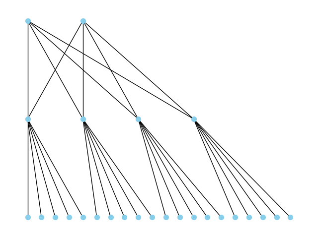
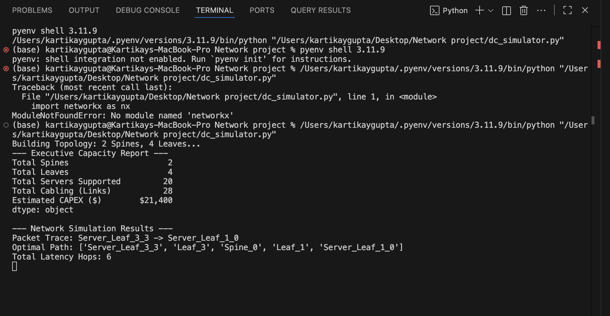

# Network Deployment Optimizer 🌐

### Data Center Topology Simulator & Capacity Planner



## 📌 Project Overview
The **Network Deployment Optimizer** is a Python-based simulation tool designed to streamline **Data Center Network (DCN) planning**. It models industry-standard **Leaf-Spine architectures** to forecast infrastructure costs (CAPEX) and analyze network performance before physical deployment.

This project addresses key challenges in **Network Deployment Optimization**—a critical function for Technical Program Managers (TPMs) in cloud networking—by automating capacity planning and ensuring **Resource Stewardship**.

## 🚀 Key Features for Network Program Management
* **💸 CAPEX Forecasting (Resource Stewardship):** Automatically calculates the financial impact of new cluster build-outs (switches, cabling, and optics), enabling data-driven budget approvals.
* **⚡ Latency Simulation & Pathfinding:** Implements **Dijkstra’s algorithm** to model packet flow between servers, identifying optimal paths and potential bottlenecks to ensure SLA compliance.
* **📊 Topology Visualization:** Generates visual maps of non-blocking Leaf-Spine fabrics to assist in cross-functional communication with installation teams and network engineers.
* **📉 Cost Optimization:** Models different scaling scenarios to determine the most cost-effective architecture for required bandwidth capacity.

## 🛠️ Technical Implementation
* **Language:** Python 3.x
* **Libraries:** `NetworkX` (Graph Theory), `Matplotlib` (Visualization), `Pandas` (Reporting)
* **Architecture:** Leaf-Spine (2-Tier Non-Blocking Fabric)
* **Algorithms:** Shortest Path (Dijkstra) for latency minimization

## 📊 Sample Output (Executive Report)
The tool generates an "Executive Capacity Report" used for decision support:



```text
--- Executive Capacity Report ---
Total Spines             2
Total Leaves             4
Total Servers Supported  20
Total Cabling (Links)    28
Estimated CAPEX ($)      $21,400
```
# 💻 How to Run
## 1. Clone the repository:
git clone [https://github.com/Kartikay77/Network-Deployment-Optimizer.git](https://github.com/Kartikay77/Network-Deployment-Optimizer.git)
cd Network-Deployment-Optimizer

## 2. Install dependencies:
```
pip install networkx matplotlib pandas numpy
```

## 3. Run the simulator:
```
python dc_simulator.py
```
# 🧠 Why Leaf-Spine?
This project simulates a Leaf-Spine topology rather than a traditional 3-tier architecture because:

1. Lower Latency: Every leaf switch is connected to every spine switch, ensuring a maximum of 3 hops between any two servers.

2. Scalability: New racks (Leaves) can be added without rebuilding the core network.

3. Reliability: The full-mesh design provides redundancy; if one Spine fails, traffic is automatically rerouted.
